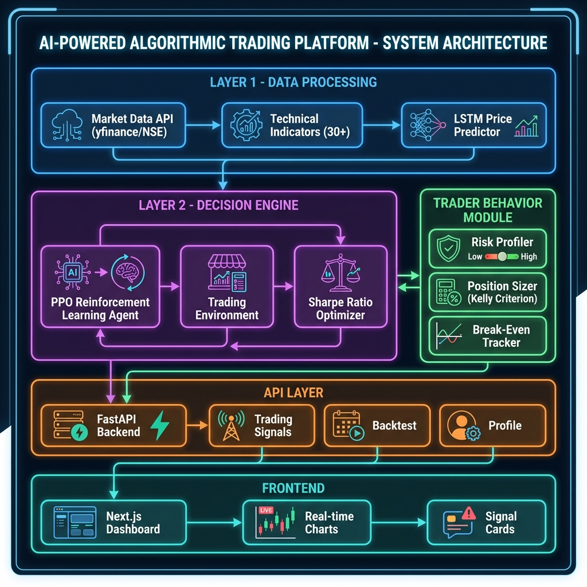

# Deep Learning for Algorithmic Trading

> AI-Powered Trading Platform for Indian Markets (NSE/BSE) using Deep Reinforcement Learning



## 🎯 Project Overview

This platform combines **Deep Learning** and **Reinforcement Learning** to create an intelligent trading system that:

1. **Predicts** stock prices using LSTM neural networks
2. **Optimizes** trading decisions using PPO reinforcement learning
3. **Personalizes** strategies based on individual risk tolerance
4. **Targets** the Indian stock market (NSE/BSE)

---

## ⚡ Quick Start

### Prerequisites

- Python 3.10+
- Node.js 18+
- Git

### Installation

```bash
# Clone repository
git clone https://github.com/itzraghavg9104/Deep-Learning-for-Algo-Trading.git
cd Deep-Learning-for-Algo-Trading

# Backend setup
cd backend
python -m venv venv
.\venv\Scripts\activate  # Windows
pip install -r requirements.txt

# Frontend setup
cd ../frontend
npm install
```

### Run Application

```bash
# Terminal 1: Backend
cd backend
.\venv\Scripts\activate
uvicorn app.main:app --reload

# Terminal 2: Frontend
cd frontend
npm run dev
```

**Access:**
- Frontend: http://localhost:3000
- API Docs: http://localhost:8000/docs

---

## 🏗️ Architecture

```
┌─────────────────────────────────────────────────────────────┐
│                    LAYER 1: DATA PROCESSING                 │
├─────────────────────────────────────────────────────────────┤
│  Market Data (yfinance)  │  Technical Indicators (30+)      │
│  LSTM Price Predictor    │  State Vector Builder            │
└──────────────────────────┼──────────────────────────────────┘
                           │
                           ▼
┌─────────────────────────────────────────────────────────────┐
│                    LAYER 2: DECISION ENGINE                 │
├─────────────────────────────────────────────────────────────┤
│  PPO Agent (Stable-Baselines3)  │  Sharpe Ratio Optimizer   │
│  Custom Trading Environment     │  Risk-Adjusted Rewards    │
└──────────────────────────┼──────────────────────────────────┘
                           │
                           ▼
┌─────────────────────────────────────────────────────────────┐
│                    TRADER BEHAVIOR MODULE                   │
├─────────────────────────────────────────────────────────────┤
│  Risk Profiler           │  Position Sizer (Kelly Criterion)│
│  Break-Even Tracker      │  Personalized Recommendations    │
└─────────────────────────────────────────────────────────────┘
```

---

## 📊 Training Results

### LSTM Price Predictor

| Metric | Value |
|--------|-------|
| Architecture | LSTM (64 hidden, 2 layers) |
| Training Samples | 23,167 |
| Validation Loss | **0.000228** |

### PPO Trading Agent

| Metric | Value |
|--------|-------|
| Training Timesteps | 30,000 |
| Average Return | **132.28%** |
| Sharpe Ratio | **0.66** |

---

## 📁 Project Structure

```
Deep-Learning-for-Algo-Trading/
├── backend/
│   ├── app/
│   │   ├── api/routes/          # FastAPI endpoints
│   │   ├── layer1_data_processing/
│   │   │   ├── market_data.py   # NSE/BSE data
│   │   │   ├── technical_indicators.py
│   │   │   └── state_builder.py
│   │   ├── layer2_decision/
│   │   │   ├── trading_env.py   # Gym environment
│   │   │   ├── ppo_agent.py
│   │   │   └── reward_function.py
│   │   ├── trader_behavior/
│   │   │   ├── risk_profiler.py
│   │   │   ├── position_sizer.py
│   │   │   └── breakeven_tracker.py
│   │   └── services/
│   │       └── prediction_service.py
│   ├── training/
│   │   ├── train_lstm.py        # LSTM training
│   │   ├── train_ppo.py         # PPO training
│   │   └── download_data.py     # Data downloader
│   └── models/                  # Trained models
├── frontend/
│   └── src/
│       ├── app/                 # Next.js pages
│       ├── components/          # React components
│       └── lib/                 # API client
├── docs/                        # Documentation
└── references/                  # Research papers
```

---

## 📖 Documentation

| Document | Description |
|----------|-------------|
| [Architecture](docs/01_architecture.md) | System design and diagrams |
| [Data Processing](docs/02_data_processing.md) | Layer 1: Market data, indicators, LSTM |
| [Decision Engine](docs/03_decision_engine.md) | Layer 2: PPO agent, environment |
| [Trader Behavior](docs/04_trader_behavior.md) | Risk profiling, position sizing |
| [API Reference](docs/05_api_reference.md) | REST API documentation |
| [Deployment](docs/06_deployment.md) | Docker, environment setup |

---

## 🔧 Training Models

### Download Data

```bash
cd backend
.\venv\Scripts\python training\download_data.py
```

Downloads 5 years of NIFTY 50 data (20 stocks) to `data/training_data.csv`.

### Train LSTM

```bash
.\venv\Scripts\python training\train_lstm.py
```

Trains price prediction model. Saves to `models/lstm_final.pt`.

### Train PPO

```bash
.\venv\Scripts\python training\train_ppo.py
```

Trains RL agent. Saves to `models/ppo_trading_final.zip`.

---

## 🌐 API Endpoints

| Endpoint | Method | Description |
|----------|--------|-------------|
| `/api/v1/trading/signals/{symbol}` | GET | AI trading signal |
| `/api/v1/trading/watchlist` | GET | Top NSE stocks |
| `/api/v1/backtest/run` | POST | Run backtest |
| `/api/v1/profile/risk-assessment` | POST | Risk profiling |

Full API docs at `http://localhost:8000/docs`

---

## 🚀 Technology Stack

| Layer | Technology |
|-------|------------|
| **Backend** | FastAPI, Python 3.10+ |
| **ML** | PyTorch, Stable-Baselines3 |
| **Frontend** | Next.js 14, TailwindCSS |
| **Data** | yfinance, pandas-ta |

---

## 📄 References

- [DeepAR: Probabilistic Forecasting](references/)
- [RL for Portfolio Management](references/)
- [Neural Network Trading](references/)

---

## 👤 Author

**Raghav Gupta**
- GitHub: [@itzraghavg9104](https://github.com/itzraghavg9104)

---

## 📝 License

This project is for educational purposes (College Major Project).
