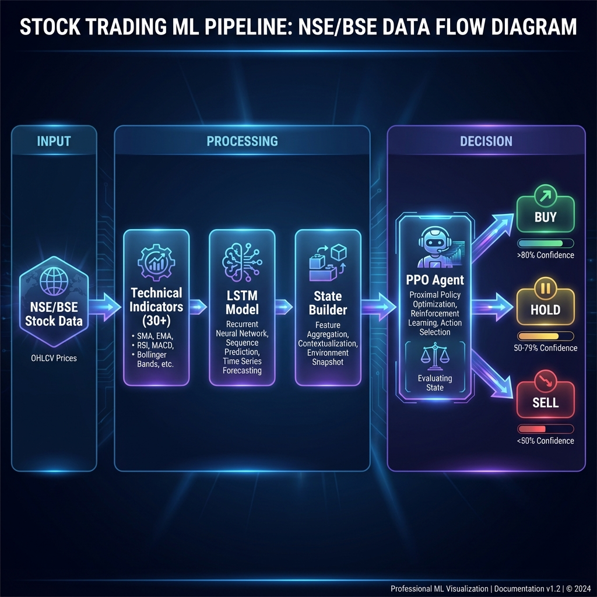
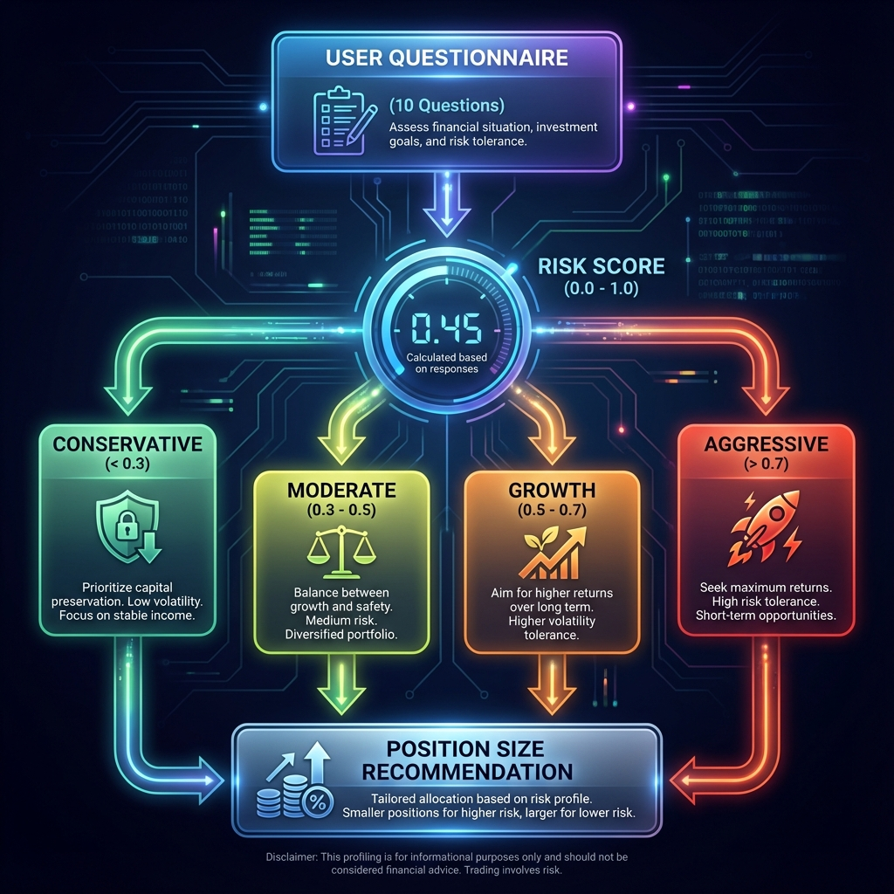

# System Architecture

> AI-Powered Algorithmic Trading Platform for Indian Markets (NSE/BSE)

## Architecture Overview


Our platform implements a **two-stage architecture** that mimics the cognitive process of professional traders:

1. **Layer 1 (Data Processing)**: Analyzes market data and generates predictions
2. **Layer 2 (Decision Engine)**: Optimizes trading decisions using reinforcement learning
3. **Trader Behavior Module**: Personalizes strategies based on individual risk tolerance

---

## Data Flow Pipeline



The data flows through the system in three stages:
1. **Input**: Real-time NSE/BSE stock data via yfinance API
2. **Processing**: Technical indicators + LSTM predictions combined into state vector
3. **Decision**: PPO agent outputs optimal trading action with confidence score

---

## Component Details

### Layer 1: Data Processing

| Component | Technology | Purpose |
|-----------|------------|---------|
| Market Data | yfinance | Fetch OHLCV data from NSE/BSE |
| Technical Indicators | pandas-ta | Compute 30+ indicators (RSI, MACD, BB, etc.) |
| LSTM Predictor | PyTorch | Probabilistic price forecasting |
| State Builder | NumPy | Normalize and combine all features |

**Files:**
- [`market_data.py`](../backend/app/layer1_data_processing/market_data.py) - NSE/BSE data fetching
- [`technical_indicators.py`](../backend/app/layer1_data_processing/technical_indicators.py) - 30+ indicators
- [`state_builder.py`](../backend/app/layer1_data_processing/state_builder.py) - Feature normalization

---

### Layer 2: Decision Engine


| Component | Technology | Purpose |
|-----------|------------|---------|
| Trading Environment | Gymnasium | Custom trading simulation |
| PPO Agent | Stable-Baselines3 | Policy optimization |
| Reward Function | Custom | Sharpe Ratio optimization |

**Training Results:**
- **Average Return**: 132.28%
- **Sharpe Ratio**: 0.66
- **Timesteps**: 30,000

**Files:**
- [`trading_env.py`](../backend/app/layer2_decision/trading_env.py) - Gymnasium environment
- [`ppo_agent.py`](../backend/app/layer2_decision/ppo_agent.py) - PPO wrapper
- [`reward_function.py`](../backend/app/layer2_decision/reward_function.py) - Sharpe optimization

---

### Trader Behavior Module



**Components:**
- **Risk Profiler**: Questionnaire-based risk assessment (0.0-1.0 score)
- **Position Sizer**: Kelly Criterion, volatility-adjusted sizing
- **Break-Even Tracker**: P&L and position management

---

## Training Pipeline


**Step 1**: Download 5 years of NIFTY 50 data (20 stocks)
**Step 2**: Train LSTM model (Val Loss: 0.000228)
**Step 3**: Train PPO agent (132% Return, 0.66 Sharpe)
**Step 4**: Deploy to FastAPI for real-time predictions

---

## Technology Stack

| Layer | Technology | Version |
|-------|------------|---------|
| Backend | FastAPI | 0.100+ |
| ML Training | PyTorch | 2.0+ |
| RL Agent | Stable-Baselines3 | 2.0+ |
| Frontend | Next.js | 14+ |
| Styling | TailwindCSS | 3.0+ |
| State Management | Zustand | 4.0+ |

---

## Directory Structure

```
Deep-Learning-for-Algo-Trading/
├── backend/
│   ├── app/
│   │   ├── api/routes/         # FastAPI endpoints
│   │   ├── layer1_data_processing/
│   │   ├── layer2_decision/
│   │   ├── trader_behavior/
│   │   └── services/
│   ├── training/               # Training scripts
│   ├── models/                 # Trained models
│   └── data/                   # Training data
├── frontend/
│   └── src/
│       ├── app/                # Next.js pages
│       ├── components/         # React components
│       └── lib/                # Utilities
├── docs/                       # Documentation
│   └── images/                 # Diagram images
└── references/                 # Research papers
```

---

## Next Steps

1. **Database Integration**: PostgreSQL for user profiles and trade history
2. **Authentication**: JWT-based user authentication
3. **Docker Deployment**: Containerized production deployment
4. **Real-time WebSocket**: Live price updates
