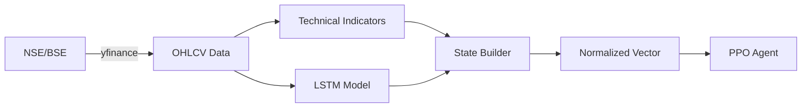
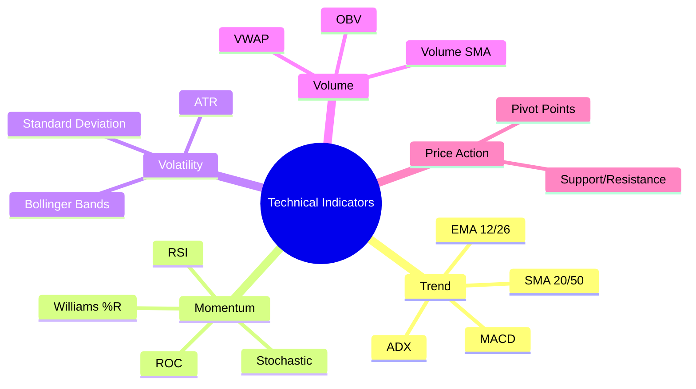
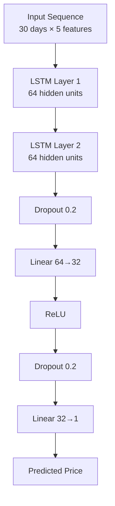
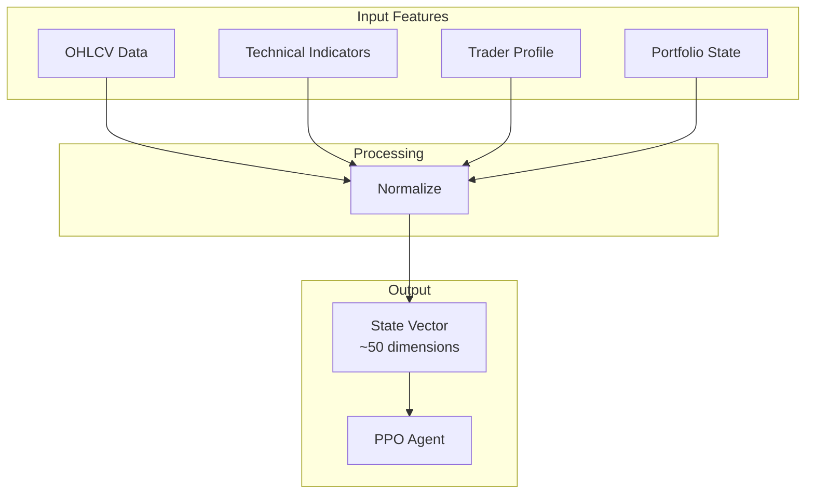

# Data Processing Layer (Layer 1)

> Market data fetching, technical indicators, and LSTM-based price prediction

## Overview

Layer 1 is responsible for:
1. **Fetching market data** from NSE/BSE via yfinance
2. **Computing technical indicators** (30+ indicators)
3. **Predicting future prices** using trained LSTM model
4. **Building state vectors** for the PPO agent

---

## Data Flow



---

## Market Data Module

### Implementation

**File:** [`market_data.py`](file:///d:/Major%20Project/backend/app/layer1_data_processing/market_data.py)

```python
# Key functions
async def get_market_data(symbol: str, period: str = "1mo") -> pd.DataFrame
def fetch_market_data_sync(symbol: str, period: str = "1mo") -> pd.DataFrame
```

### Supported Exchanges

| Exchange | Symbol Suffix | Example |
|----------|---------------|---------|
| NSE | `.NS` | `RELIANCE.NS` |
| BSE | `.BO` | `RELIANCE.BO` |

### NIFTY 50 Stocks

The system supports all NIFTY 50 constituents including:
- RELIANCE, TCS, INFY, HDFCBANK, ICICIBANK
- SBIN, BHARTIARTL, ITC, KOTAKBANK, LT
- HINDUNILVR, AXISBANK, BAJFINANCE, MARUTI, ASIANPAINT
- And 5 more...

---

## Technical Indicators

### Implementation

**File:** [`technical_indicators.py`](file:///d:/Major%20Project/backend/app/layer1_data_processing/technical_indicators.py)

### Indicator Categories



### Full Indicator List (30+)

| Category | Indicators |
|----------|------------|
| **Moving Averages** | SMA_20, SMA_50, EMA_12, EMA_26 |
| **MACD** | MACD, MACD_Signal, MACD_Hist |
| **RSI** | RSI_14 |
| **Bollinger Bands** | BB_Upper, BB_Middle, BB_Lower, BB_Width |
| **Stochastic** | STOCH_K, STOCH_D |
| **ADX** | ADX, DI_Plus, DI_Minus |
| **ATR** | ATR |
| **OBV** | OBV |
| **Williams %R** | WILLR |
| **ROC** | ROC |

---

## LSTM Price Predictor

### Architecture



### Training Details

| Parameter | Value |
|-----------|-------|
| Input Features | Open, High, Low, Close, Volume |
| Sequence Length | 30 days |
| Hidden Size | 64 |
| LSTM Layers | 2 |
| Dropout | 0.2 |
| Optimizer | Adam |
| Learning Rate | 0.001 |
| Epochs | 30 |

### Training Results

| Metric | Value |
|--------|-------|
| Training Samples | 23,167 |
| Validation Samples | 5,792 |
| **Best Val Loss** | **0.000228** |
| Training Time | ~3 minutes |

### Training Script

**File:** [`training/train_lstm.py`](file:///d:/Major%20Project/backend/training/train_lstm.py)

```bash
# To train the model
cd backend
.\venv\Scripts\python training\train_lstm.py
```

---

## State Builder

### Implementation

**File:** [`state_builder.py`](file:///d:/Major%20Project/backend/app/layer1_data_processing/state_builder.py)

### State Vector Components



### Normalization

All features are normalized to [0, 1] range using:
- **MinMax Scaling** for prices and volumes
- **Z-Score Normalization** for returns
- **Raw values** for bounded indicators (RSI, etc.)

---

## Usage Example

```python
from app.layer1_data_processing import (
    get_market_data,
    compute_indicators,
    StateBuilder
)

# Fetch data
data = await get_market_data("RELIANCE.NS", period="3mo")

# Compute indicators
indicators = compute_indicators(data)

# Build state for PPO
state_builder = StateBuilder()
state = state_builder.build_state(
    data=data,
    indicators=indicators,
    risk_tolerance=0.5,
    portfolio_value=100000
)

print(f"State shape: {state.shape}")  # (50,)
```

---

## API Integration

The prediction service integrates Layer 1 outputs with the API:

**File:** [`services/prediction_service.py`](file:///d:/Major%20Project/backend/app/services/prediction_service.py)

```python
from app.services.prediction_service import get_prediction_service

service = get_prediction_service()
prediction = service.predict("RELIANCE.NS")

# Returns:
# {
#     "symbol": "RELIANCE.NS",
#     "current_price": 1544.40,
#     "predicted_price": 1560.25,
#     "price_change": 15.85,
#     "change_pct": 1.03,
#     "action": "BUY",
#     "confidence": 0.72,
#     "model": "LSTM"
# }
```
