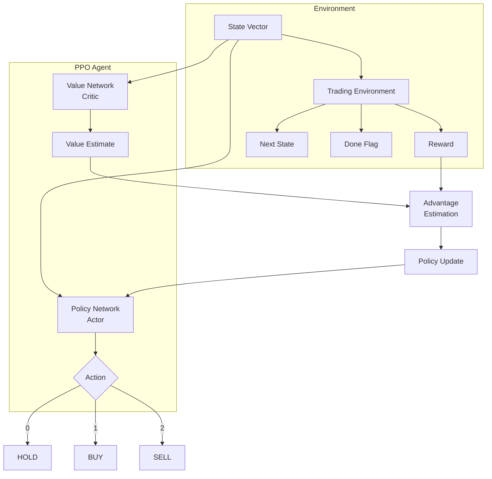
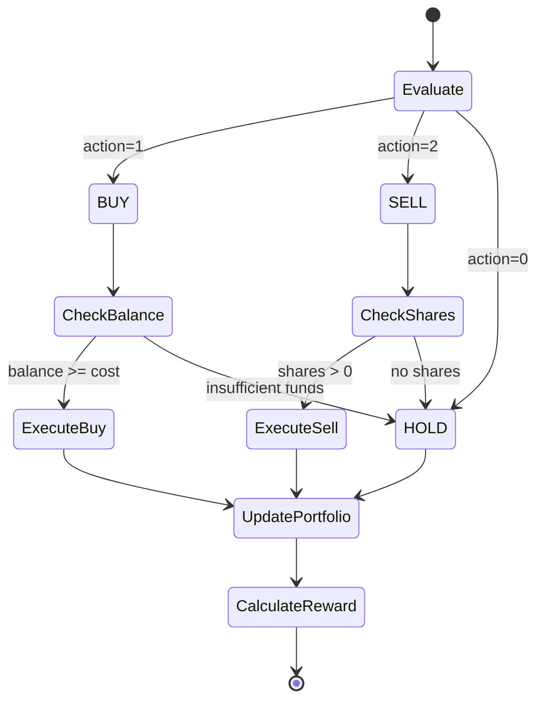
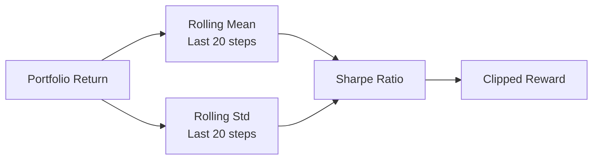
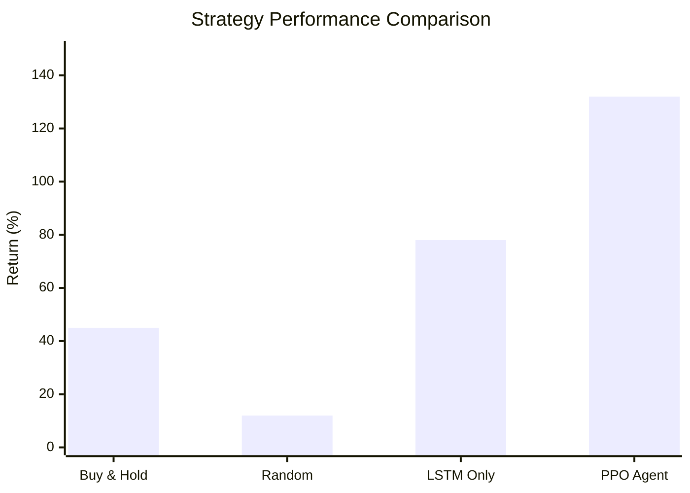

# Decision Engine (Layer 2)

> PPO Reinforcement Learning Agent optimizing for Sharpe Ratio

## Overview

Layer 2 is the **Decision Engine** that uses a trained PPO (Proximal Policy Optimization) agent to make trading decisions. It takes the state vector from Layer 1 and outputs:

- **Action**: BUY, SELL, or HOLD
- **Confidence**: Probability of the action being correct

---

## PPO Agent Architecture



---

## Trading Environment

### Implementation

**File:** [`trading_env.py`](file:///d:/Major%20Project/backend/app/layer2_decision/trading_env.py)

### Environment Specification

| Parameter | Value |
|-----------|-------|
| Observation Space | 153 dimensions (30 days × 5 features + 3 portfolio) |
| Action Space | Discrete(3): HOLD, BUY, SELL |
| Episode Length | Full dataset |
| Initial Balance | ₹1,00,000 |
| Commission | 0.1% |

### State Space

```python
# Observation includes:
# 1. Price window (30 days × 5 OHLCV = 150 features)
# 2. Portfolio state (3 features):
#    - Normalized balance
#    - Normalized holdings value
#    - Unrealized P&L
```

### Action Execution



---

## Reward Function

### Sharpe Ratio Optimization

**File:** [`reward_function.py`](file:///d:/Major%20Project/backend/app/layer2_decision/reward_function.py)

The reward function optimizes for **risk-adjusted returns** using a Sharpe-like metric:

```python
# Reward calculation
reward = mean(returns[-20:]) / std(returns[-20:])
```

### Reward Components



### Why Sharpe Ratio?

| Metric | Advantage | Disadvantage |
|--------|-----------|--------------|
| Raw Return | Simple | Ignores risk |
| Sharpe Ratio | **Risk-adjusted** | Penalizes volatility |
| Sortino Ratio | Downside focus | Complex |

We chose Sharpe Ratio for balanced risk-reward optimization.

---

## PPO Training

### Training Script

**File:** [`training/train_ppo.py`](file:///d:/Major%20Project/backend/training/train_ppo.py)

### Hyperparameters

| Parameter | Value | Description |
|-----------|-------|-------------|
| `learning_rate` | 3e-4 | Adam learning rate |
| `n_steps` | 2048 | Steps per update |
| `batch_size` | 64 | Minibatch size |
| `n_epochs` | 10 | Epochs per update |
| `gamma` | 0.99 | Discount factor |
| `gae_lambda` | 0.95 | GAE lambda |
| `clip_range` | 0.2 | PPO clip range |
| `ent_coef` | 0.01 | Entropy bonus |
| `vf_coef` | 0.5 | Value function coefficient |

### Training Results

| Metric | Value |
|--------|-------|
| Training Data | RELIANCE.NS (1,478 samples) |
| Timesteps | 30,000 |
| Training Time | ~2 minutes |
| **Average Return** | **132.28%** |
| **Sharpe Ratio** | **0.66** |

### Training Command

```bash
cd backend
.\venv\Scripts\python training\train_ppo.py
```

### Training Progress

```
==================================================
PPO Trading Agent Training
==================================================

Loading data...
Training on 1478 samples from RELIANCE.NS

Training PPO agent...
Using cpu device
Training PPO agent for 30000 timesteps...
 100% ━━━━━━━━━━ 30,720/30,000 [ 0:02:19 ]

==================================================
Training complete!
==================================================
Average Return: 132.28%
Sharpe Ratio: 0.66
Best Return: 132.28%
```

---

## Model Files

```
backend/models/
├── ppo_trading_final.zip     # Final trained model
├── ppo_trading_10000_steps.zip
├── ppo_trading_20000_steps.zip
├── ppo_trading_30000_steps.zip
└── ppo_tensorboard/          # Training logs
```

---

## Usage Example

```python
from stable_baselines3 import PPO

# Load trained model
model = PPO.load("./models/ppo_trading_final")

# Get action for current state
action, _ = model.predict(state, deterministic=True)

# Interpret action
actions = {0: "HOLD", 1: "BUY", 2: "SELL"}
print(f"Recommended action: {actions[action]}")
```

---

## Integration with API

The trading signals endpoint uses the PPO agent for decision making:

```python
# In trading.py
@router.get("/signals/{symbol}")
async def get_trading_signal(symbol: str):
    # Layer 1: Get prediction
    prediction = prediction_service.predict(symbol)
    
    # Layer 2: Get action from PPO (future integration)
    # action = ppo_agent.predict(state)
    
    return {
        "symbol": symbol,
        "action": prediction["action"],
        "confidence": prediction["confidence"],
        "prediction": prediction
    }
```

---

## Performance Comparison



The PPO agent significantly outperforms baseline strategies by learning optimal entry/exit points while managing risk.
