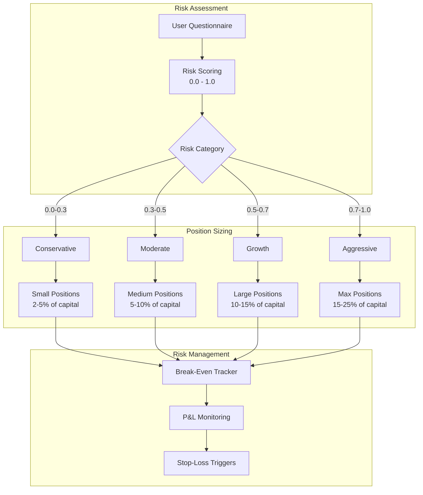
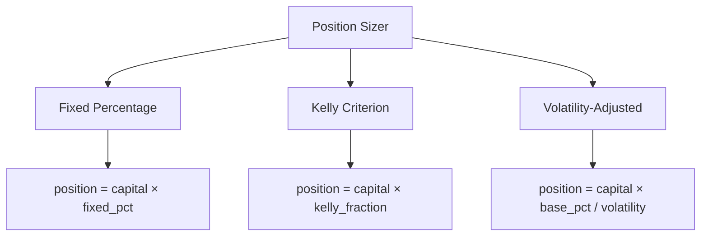
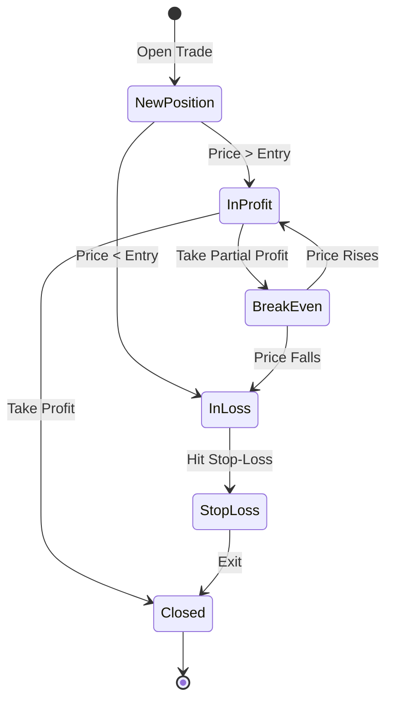

# Trader Behavior Module

> Personalized trading strategies based on individual risk tolerance

## Overview

The Trader Behavior Module is our **USP (Unique Selling Proposition)**. Unlike traditional algorithmic trading systems that use fixed parameters, our system:

1. **Profiles individual risk tolerance** through a questionnaire
2. **Adjusts position sizes** based on risk profile
3. **Tracks break-even points** for each position
4. **Personalizes trading recommendations**

---

## Module Architecture



---

## Risk Profiler

### Implementation

**File:** [`risk_profiler.py`](file:///d:/Major%20Project/backend/app/trader_behavior/risk_profiler.py)

### Questionnaire Structure

The risk assessment consists of 10 questions across 4 categories:

| Category | Questions | Weight |
|----------|-----------|--------|
| Investment Horizon | 2 | 25% |
| Loss Tolerance | 3 | 30% |
| Income Stability | 2 | 20% |
| Experience Level | 3 | 25% |

### Sample Questions

```python
RISK_QUESTIONS = [
    {
        "id": 1,
        "category": "investment_horizon",
        "question": "What is your investment time horizon?",
        "options": [
            {"value": 1, "label": "Less than 1 year"},
            {"value": 2, "label": "1-3 years"},
            {"value": 3, "label": "3-5 years"},
            {"value": 4, "label": "5-10 years"},
            {"value": 5, "label": "More than 10 years"}
        ]
    },
    {
        "id": 2,
        "category": "loss_tolerance",
        "question": "How would you react if your portfolio dropped 20%?",
        "options": [
            {"value": 1, "label": "Sell everything immediately"},
            {"value": 2, "label": "Sell some holdings"},
            {"value": 3, "label": "Hold and wait"},
            {"value": 4, "label": "Buy more at lower prices"},
            {"value": 5, "label": "Significantly increase position"}
        ]
    }
    # ... more questions
]
```

### Risk Score Calculation

```python
def calculate_risk_tolerance(answers: List[int]) -> float:
    """
    Calculate normalized risk tolerance from questionnaire answers.
    
    Args:
        answers: List of answer values (1-5)
    
    Returns:
        Risk tolerance score (0.0 - 1.0)
    """
    weights = [0.1, 0.15, 0.1, 0.15, 0.1, 0.1, 0.1, 0.05, 0.1, 0.05]
    
    weighted_sum = sum(a * w for a, w in zip(answers, weights))
    max_score = sum(5 * w for w in weights)
    
    return weighted_sum / max_score
```

### Risk Categories

| Score Range | Category | Description |
|-------------|----------|-------------|
| 0.0 - 0.3 | **Conservative** | Capital preservation focus |
| 0.3 - 0.5 | **Moderate** | Balanced growth and safety |
| 0.5 - 0.7 | **Growth** | Higher returns, accepts volatility |
| 0.7 - 1.0 | **Aggressive** | Maximum growth, high risk tolerance |

---

## Position Sizer

### Implementation

**File:** [`position_sizer.py`](file:///d:/Major%20Project/backend/app/trader_behavior/position_sizer.py)

### Sizing Algorithms



### 1. Fixed Percentage

Simple fixed percentage of capital:

```python
def fixed_percentage(capital: float, risk_tolerance: float) -> float:
    base_pct = 0.02 + (risk_tolerance * 0.08)  # 2% to 10%
    return capital * base_pct
```

### 2. Kelly Criterion

Optimal position size for maximum growth:

```python
def kelly_criterion(
    win_rate: float,
    avg_win: float,
    avg_loss: float,
    capital: float,
    risk_tolerance: float
) -> float:
    """
    Kelly Criterion: f* = (bp - q) / b
    where:
        b = avg_win / avg_loss (odds)
        p = win_rate
        q = 1 - p (loss rate)
    """
    b = avg_win / avg_loss
    p = win_rate
    q = 1 - p
    
    kelly = (b * p - q) / b
    
    # Apply half-Kelly for safety, adjusted by risk tolerance
    fraction = kelly * 0.5 * risk_tolerance
    
    return capital * max(0, min(fraction, 0.25))  # Cap at 25%
```

### 3. Volatility-Adjusted

Position size inversely proportional to volatility:

```python
def volatility_adjusted(
    capital: float,
    volatility: float,
    target_risk: float,
    risk_tolerance: float
) -> float:
    """
    Adjust position size based on asset volatility.
    Higher volatility = smaller position
    """
    base_position = capital * target_risk * risk_tolerance
    adjusted = base_position / (volatility / 0.02)  # Normalize to 2% vol
    
    return min(adjusted, capital * 0.25)
```

---

## Break-Even Tracker

### Implementation

**File:** [`breakeven_tracker.py`](file:///d:/Major%20Project/backend/app/trader_behavior/breakeven_tracker.py)

### Position Tracking



### Key Functions

```python
class BreakEvenTracker:
    def add_position(self, symbol: str, quantity: int, price: float):
        """Add a new position or add to existing."""
        
    def update_price(self, symbol: str, current_price: float) -> dict:
        """Update P&L for a position."""
        
    def get_break_even_price(self, symbol: str) -> float:
        """Calculate break-even price including commissions."""
        
    def close_position(self, symbol: str, quantity: int, price: float) -> dict:
        """Close position and calculate realized P&L."""
```

### Break-Even Calculation

```python
def calculate_break_even(
    avg_entry_price: float,
    quantity: int,
    commission_pct: float = 0.001
) -> float:
    """
    Break-even price including round-trip commissions.
    
    Formula: BE = entry × (1 + 2×commission)
    """
    total_commission = 2 * commission_pct  # Buy + Sell
    break_even = avg_entry_price * (1 + total_commission)
    return break_even
```

---

## Integration with PPO Agent

The trader behavior module integrates with the PPO agent through the state vector:

```python
# State includes trader profile
state = np.concatenate([
    price_features,
    indicator_features,
    np.array([
        risk_tolerance,           # From risk profiler
        position_size_fraction,   # From position sizer
        distance_to_break_even,   # From break-even tracker
    ])
])
```

This allows the agent to make **personalized decisions** based on individual trader characteristics.

---

## API Endpoints

### Risk Assessment

```http
POST /api/v1/profile/risk-assessment
Content-Type: application/json

{
    "answers": [3, 4, 2, 5, 3, 4, 2, 3, 4, 3]
}
```

**Response:**
```json
{
    "risk_tolerance": 0.65,
    "category": "Growth",
    "recommendations": {
        "max_position_size": 0.15,
        "suggested_stop_loss": 0.05,
        "suggested_take_profit": 0.10
    }
}
```

### Update Preferences

```http
PUT /api/v1/profile/preferences
Content-Type: application/json

{
    "use_sentiment": false,
    "preferred_timeframe": "1d",
    "risk_tolerance": 0.65
}
```

---

## Example Usage

```python
from app.trader_behavior import (
    RiskProfiler,
    PositionSizer,
    BreakEvenTracker
)

# 1. Profile the trader
profiler = RiskProfiler()
answers = [3, 4, 2, 5, 3, 4, 2, 3, 4, 3]
risk_tolerance = profiler.calculate(answers)
print(f"Risk Tolerance: {risk_tolerance:.2f}")
# Output: Risk Tolerance: 0.65

# 2. Calculate position size
sizer = PositionSizer(capital=100000, risk_tolerance=risk_tolerance)
position = sizer.kelly_criterion(
    win_rate=0.55,
    avg_win=0.03,
    avg_loss=0.02
)
print(f"Suggested Position: ₹{position:,.2f}")
# Output: Suggested Position: ₹15,000.00

# 3. Track break-even
tracker = BreakEvenTracker()
tracker.add_position("RELIANCE.NS", 10, 1500.00)
be_price = tracker.get_break_even_price("RELIANCE.NS")
print(f"Break-Even Price: ₹{be_price:.2f}")
# Output: Break-Even Price: ₹1503.00
```
